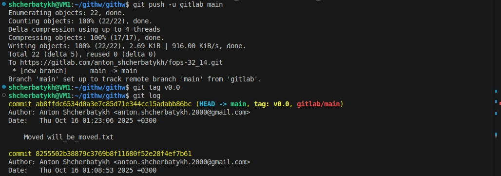
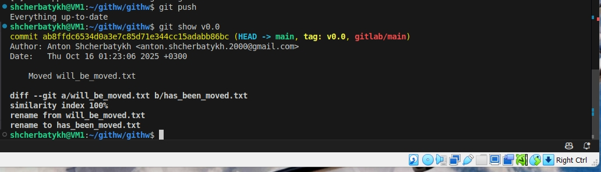
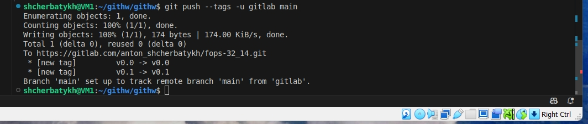
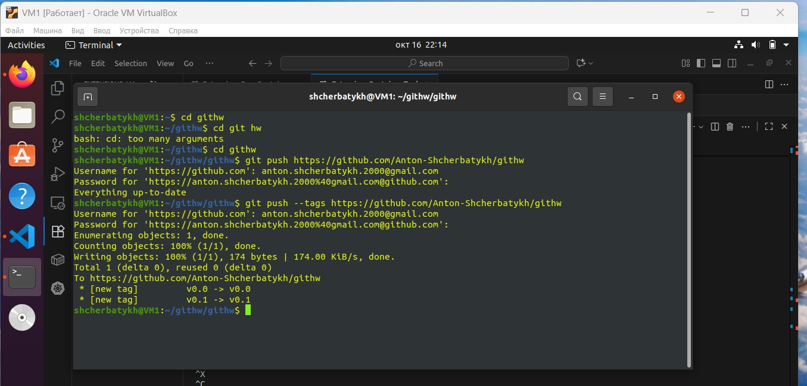
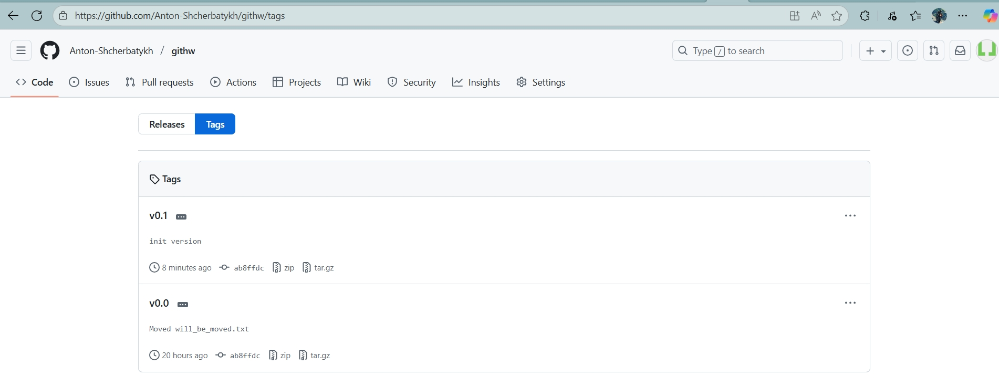
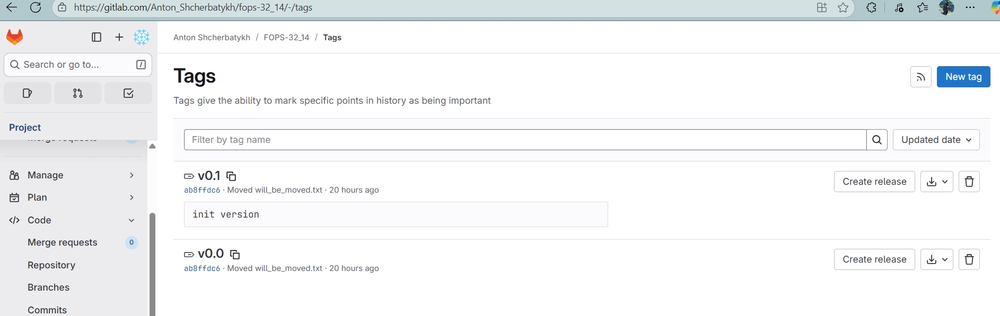
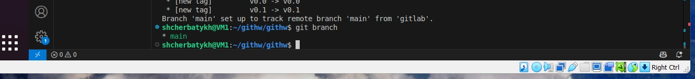
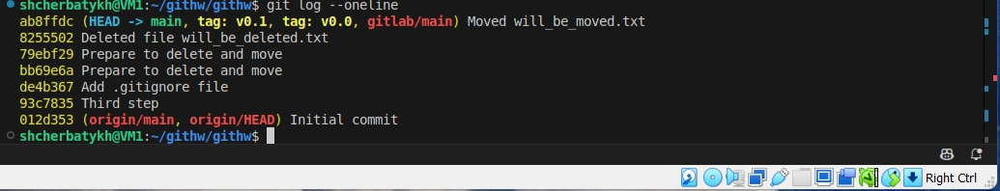
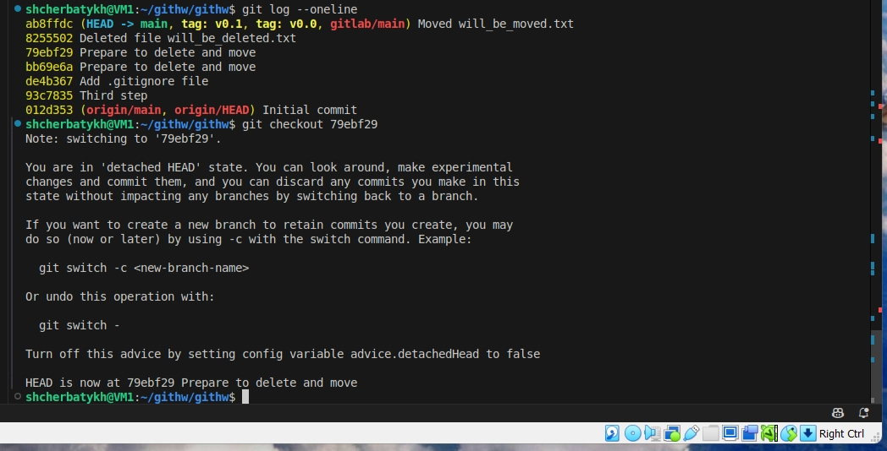
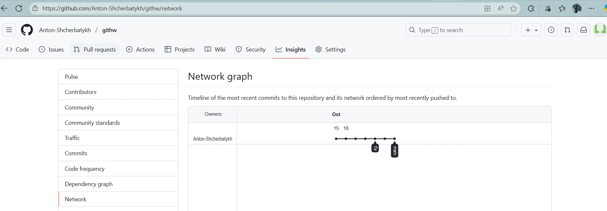

## Домашнее задание к занятию «Основы Git» (Щербатых А.Е.)
### Задание 1.

**GitLab**
Создадим аккаунт в GitLab, если у вас его ещё нет:

GitLab. Для регистрации можно использовать аккаунт Google, GitHub и другие.

После регистрации или авторизации в GitLab создайте новый проект, нажав на ссылку ```Create a projet```. Желательно назвать также, как и в GitHub — ```devops-netology``` и ```visibility level```, выбрать ```Public```.

Галочку ```Initialize repository with a README``` лучше не ставить, чтобы не пришлось разрешать конфликты.

Если вы зарегистрировались при помощи аккаунта в другой системе и не указали пароль, то увидите сообщение: ```You won't be able to pull or push project code via HTTPS until you set a password on your account```. Тогда перейдите по ссылке из этого сообщения и задайте пароль. Если вы уже умеете пользоваться SSH-ключами, то воспользуйтесь этой возможностью (подробнее про SSH мы поговорим в следующем учебном блоке).

Перейдите на страницу созданного вами репозитория, URL будет примерно такой: ```https://gitlab.com/YOUR_LOGIN/devops-netology```. Изучите предлагаемые варианты для начала работы в репозитории в секции ```Command line instructions```.

Запомните вывод команды ```git remote -v```.
Из-за того, что это будет наш дополнительный репозиторий, ни один вариант из перечисленных в инструкции (на странице вновь созданного репозитория) нам не подходит. Поэтому добавляем этот репозиторий, как дополнительный ```remote```, к созданному репозиторию в рамках предыдущего домашнего задания: ```git remote add gitlab https://gitlab.com/YOUR_LOGIN/devops-netology.git```.

Отправьте изменения в новый удалённый репозиторий ```git push -u gitlab main```.

Обратите внимание, как изменился результат работы команды ```git remote -v```.

### Решение 1


- Добавляю репозиторий GitLab, как дополнительный remote, к созданному репозиторию в рамках предыдущего домашнего задания
- Отправляю изменения в новый удалённый репозиторий
- Проверяю вывод команды git remote -v
- Видим, что добавился репозиторий fops-32_14.git


Выполняю push во все репозитории, визуально сравниваю их, коммиты совпадают


### Задание 2. Теги
Представьте ситуацию, когда в коде была обнаружена ошибка — надо вернуться на предыдущую версию кода, исправить её и выложить исправленный код в продакшн. Мы никуда не будем выкладывать код, но пометим некоторые коммиты тегами и создадим от них ветки.

Создайте легковестный тег v0.0 на HEAD-коммите и запуште его во все три добавленных на предыдущем этапе upstream.

Аналогично создайте аннотированный тег v0.1.

Перейдите на страницу просмотра тегов в GitHab (и в других репозиториях) и посмотрите, чем отличаются созданные теги.

в GitHub — https://github.com/YOUR_ACCOUNT/devops-netology/releases;

в GitLab — https://gitlab.com/YOUR_ACCOUNT/devops-netology/-/tags;

### Решение 2

Создал легковесный тег 0.0 на HEAD-коммите командой git tag v0.0. Проверяю результат



Видно, что у коммита с хэшем ab8ffdc6 и меткой HEAD (указатель последнего коммита в текущей ветке) есть тег v0.0.



Cоздал аннотированный тег v0.1, закоммитил и запушил в репозиторий.




Смотрю теги в web интерфейсах удаленных репозиториев




### Задание 3. Ветки
Давайте посмотрим, как будет выглядеть история коммитов при создании веток.

Переключитесь обратно на ветку main, которая должна быть связана с веткой main репозитория на github.

Посмотрите лог коммитов и найдите хеш коммита с названием Prepare to delete and move, который был создан в пределах предыдущего домашнего задания.

Выполните git checkout по хешу найденного коммита.

Создайте новую ветку fix, базируясь на этом коммите git switch -c fix.

Отправьте новую ветку в репозиторий на GitHub git push -u origin fix.

Посмотрите, как визуально выглядит ваша схема коммитов: https://github.com/YOUR_ACCOUNT/devops-netology/network.

Теперь измените содержание файла README.md, добавив новую строчку.

Отправьте изменения в репозиторий и посмотрите, как изменится схема на странице https://github.com/YOUR_ACCOUNT/devops-netology/network и как изменится вывод команды git log.

### Решение 3

Смотрю вывод команды git branch и вижу, что уже нахожусь в ветке main. Также это видно по git log --oneline, где HEAD указывает на ветку main



Сморю лог коммитов и нахожу хэш коммита с названием ```Prepare to delete and move```



Git хэш это хэш сумма, определяющая коммит в git репозиторий и являющаяся идентификатором этого коммита. Git хэш может выводиться как в полном, так и в сокращенном виде. В моем случае сокращенный хэш 79ebf29

Ввожу команду git checkout 79ebf29. Функция git checkout это перемещать указатель HEAD, т.е. выбирать то куда смотрит локальная копия репозитория.



Командой git switch -c fix создаю ветку fix

Сразу же происходит переключение на вновь созданную ветку


Отправил ветку в репозиторий с именем origin командой git push -u origin fix и посмотрел, как визуально выглядит схема коммитов репозитория по ссылке

[Выполнение задания](https://github.com/Anton-Shcherbatykh/githw/network)


