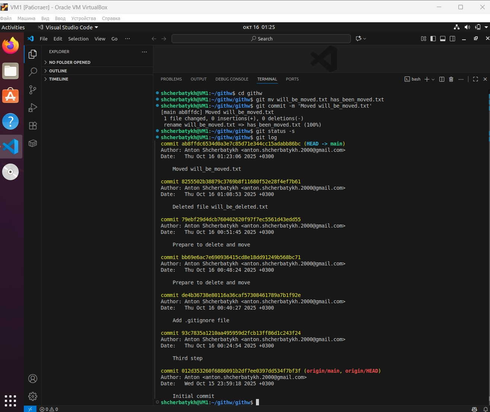

## Домашнее задание к занятию «Системы контроля версий» (Щербатых А.Е.)
### Задание 1

1. Зарегистрируйте аккаунт на https://github.com/. Если предпочитаете другое хранилище для репозитория, можно использовать его.
2. Создайте публичный репозиторий, который будете использовать дальше на протяжении всего курса, желательное с названием devops-netology. Обязательно поставьте галочку Initialize this repository with a README.
3. Создайте авторизационный токен для клонирования репозитория.
4. Склонируйте репозиторий, используя протокол HTTPS (git clone ...).
5. Перейдите в каталог с клоном репозитория (cd devops-netology).
6. Произведите первоначальную настройку Git, указав своё настоящее имя, чтобы нам было проще общаться, и email (git config --global user.name и git config --global user.email johndoe@example.com).
7. Выполните команду git status и запомните результат.
8. Отредактируйте файл README.md любым удобным способом, тем самым переведя файл в состояние Modified.
9. Ещё раз выполните git status и продолжайте проверять вывод этой команды после каждого следующего шага.
10. Теперь посмотрите изменения в файле README.md, выполнив команды git diff и git diff --staged.
11. Переведите файл в состояние staged (или, как говорят, просто добавьте файл в коммит) командой git add README.md.
12. И ещё раз выполните команды git diff и git diff --staged. Поиграйте с изменениями и этими командами, чтобы чётко понять, что и когда они отображают.
13. Теперь можно сделать коммит git commit -m 'First commit'.
14. И ещё раз посмотреть выводы команд git status, git diff и git diff --staged.

#### Создание файлов .gitignore и второго коммита

1. Создайте файл .gitignore (обратите внимание на точку в начале файла), проверьте его статус сразу после создания.
2. Добавьте файл .gitignore в следующий коммит (git add...).
3. На одном из следующих блоков вы будете изучать Terraform, давайте сразу создадим соотвествующий каталог terraform и внутри этого каталога — файл .gitignore по примеру: https://github.com/github/gitignore/blob/master/Terraform.gitignore.
4. В файле README.md опишите своими словами, какие файлы будут проигнорированы в будущем благодаря добавленному .gitignore.
5. Закоммитьте все новые и изменённые файлы. Комментарий к коммиту должен быть Added gitignore.

### ОТВЕТ

Согласно подтверждённому запросу преподавателя, в качестве выполнения работы возможно зачесть часть ДЗ из предыдущего блока

[Автоматизация и CI/СD](https://github.com/Anton-Shcherbatykh/FOPS-32/blob/main/README_2.md)

#### Эксперимент с удалением и перемещением файлов (третий и четвёртый коммит)
1. Создайте файлы will_be_deleted.txt (с текстом will_be_deleted) и will_be_moved.txt (с текстом will_be_moved) и закоммите их с комментарием Prepare to delete and move.
2. В случае необходимости обратитесь к официальной документации — здесь подробно описано, как выполнить следующие шаги.
3. Удалите файл will_be_deleted.txt с диска и из репозитория.
4. Переименуйте (переместите) файл will_be_moved.txt на диске и в репозитории, чтобы он стал называться has_been_moved.txt.
5. Закоммитьте результат работы с комментарием Moved and deleted.

### ВЫПОЛНЕНИЕ

#### Проверка изменения
1. В результате предыдущих шагов в репозитории должно быть как минимум пять коммитов (если вы сделали ещё промежуточные — нет проблем):
- Initial Commit — созданный GitHub при инициализации репозитория.
- First commit — созданный после изменения файла README.md.
- Added gitignore — после добавления .gitignore.
- Prepare to delete and move — после добавления двух временных файлов.
- Moved and deleted — после удаления и перемещения временных файлов.

2. Проверьте это, используя комманду git log. Подробно о формате вывода этой команды мы поговорим на следующем занятии, но посмотреть, что она отображает, можно уже сейчас.

#### Отправка изменений в репозиторий
Выполните команду git push, если Git запросит логин и пароль — введите ваши логин и пароль от GitHub.

В качестве результата отправьте ссылку на репозиторий.

### ВЫПОЛНЕНИЕ

[Выполненное ДЗ](https://github.com/Anton-Shcherbatykh/githw)
